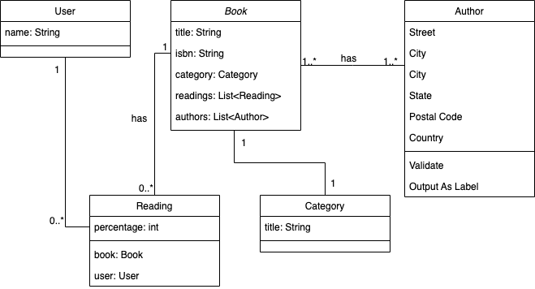

# Tô lendo
--

Nesta avaliação você irá construir o **frontend** da aplicação web chamada **Tô lendo** que tem como objetivo ajudar os seus usuários a rastrearem sua leitura.

O backend desta aplicação já existe e foi criado usando o [Strapi]().
As seguintes entidades foram modeladas no Strapi.

Além disso, foram adicionados vários livros, categorias e leituras para que você possa testar o seu código do frontend.

Segue as informações de login dos usuários:

| email | senha |
| ---- | ----|
| **admin@mail.com**| Web2022.1 | 
| joao@mail.com | 123456 |
| jeff@mail.com |123456 |
| ph@mail.com | 123456 |

## Frontend

Você deverá construir o frontend usando **Vue & Vite**. O frontend deve ser composto de **4 telas**:

- Página de login
- Página home da aplicação
- Página que mostra os detalhes de um livro
- Págin de erro 404

A imagem abaixo mostra como essas páginas estão conectadas pelas rotas do sistema.

**Todas as páginas podem ser acessadas por usuários não logados**.

### A página de login

A página de login deve conter basicamente duas coisas:

- O nome da aplicação: **Tô lendo**
- Formulário de login que pede o **email do usuário e a senha**

Nesta página você deve implementar a autenticação. É importante que em caso de falha na autenticação, o usuário seja informando que houve um erro. Ex: "Usuário ou senha inválidos"". 

### A página Home

A página Home é a principal da aplicação. 
Em seu header deve haver o **nome da aplicação**:

  - Quando um usuário estiver logado, seu nome e um link para o logoff devem aparecer no header. 
  - Quando não houver um usuário logado, o botão de login deve ficar no header

O conteúdo da área principal da página muda de acordo com a presença de um usuário logado ou não:

- Quando um usuário estiver logado, uma lista de livros chamados **Minhas leituras** deve aparecer em destaque.
  - Esta lista deve conter apenas os livros que o usuário está lendo
  - Os livros desta lista devem possuir uma barra de progresso que indica a porcentagem de páginas lidas
- A lista de todos os livros (**Biblioteca**) cadastrados deve sempre ser mostrada independente de haver um usuário logado
  - Ela deve aparecer abaixo da lista **Minhas leituras** quando houver um usuário logado
  - **Um usuário pode adicionar livros dessa lista a sua lista de leitura**. Para isso adicione um botão próximo a cada card dessa lista.

- Ambas as listas deve ser compostas de **cards** que devem mostrar as seguintes informações de um livro:
  - Título
  - Autores (no máximo 2 autores)
  - Avaliação 
  - Categoria
- Ao clicar em um desses **cards** o usuário deve ser levado a página de detalhes do livro.

**Home sem usuário logado**

**Home com usuário logado**

- Repare que aparecem informações que só aparecem quando um usuário está logado.

### Detalhes de um livro

A página de detalhes de um livro apresenta funcionalidades diferentes de acordo com a presença ou não de um usuário logado.

Quando um usuário estiver logado, ele deve ser capaz de:

- Atualizar a porcentagem de páginas lidas quando o livro clicado já estiver na lista de leituras do usuário.

Independemente de haver um usuário ou não, essa página deve mostrar as seguintes informações de um livro:

  - Título
  - Autores (Todos)
  - Editora
  - Número de páginas
  - Avaliação
  - ISBN
  - Categoria

**Detalhe de um livro sem usuário logado**

  
  
  **Detalhe de um livro com usuário logado**

- Repare que aparecem informações que só aparecem quando um usuário está logado.
  

  
### 404

Está pagina deve mostrar apenas um mensagem genérica de erro 404 para os casos onde um usuário tentar acessar uma página que não existe.

## Pontos de avaliação

| Funcionalidade | Pontuação |
| --- | --- |
| Autenticação (página de login, login & logoff) | 2 pontos |
| Página Home & Página de detalhes | 2 pontos |
| Funcionalidades de autorização (proteção de rotas & minha leituras) | 3 pontos |
| Atualização de leitura | 2 pontos |
| Rotas & 404 | 1 ponto  |

### Extra:
| Critérios | Pontuação |
| --- | --- |
| Ao adicionar o livro na lista de leituras, alterar o botão de adicionar para que ele indique que o livro já está na lista de leitura | 0.5 ponto |
| **Remover leitura**: Adicionar botão para remover leitura na lista de minhas leituras na página home e implementar a remoção ao clicar no botão| 1 ponto |
| UI | 1 ponto |
 